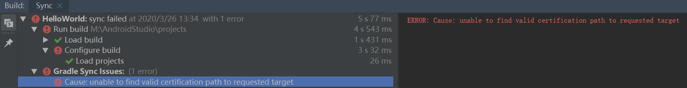
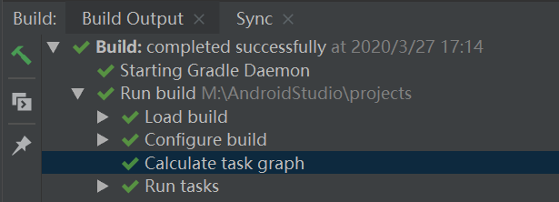
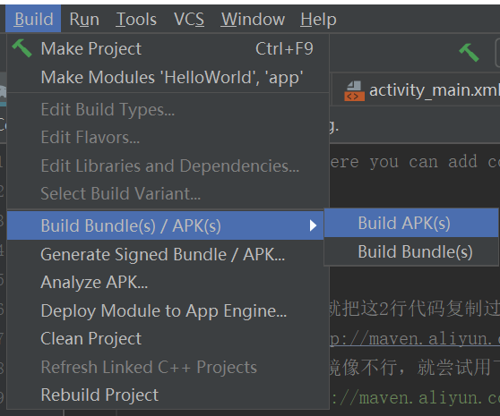
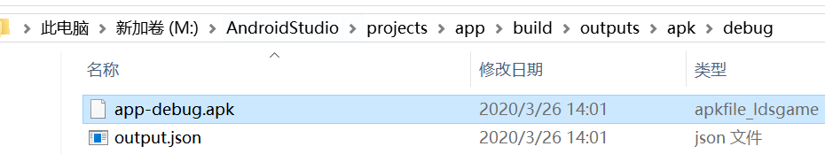

#  **Android Studio****安装教程实验**

## 一、新建区域用于后续安装 


## 二、下载安装包版本是3.5.2

//安装过程就很傻瓜式安装，注意选择的语言是java，路径选择自己一开始创建的位置就可以了，然后遇到没有SDK的提醒时关掉就可以，后面可以选择sdk安装的位置

//这里是之前下载2.0版本的截图，因为重新下载安装3.5.2版本的时候忘记截图了，但是创建工程的过程也大同小异，直接拿来用

#### 实验截图

- 创建工程


- 创建HelloWorld

 

 

- 选择一个活动


 

- 可以自己创建一个虚拟设备来模拟


## 三、问题解决

下面谈谈我遇到的问题是：unable to find valid certification path to requested target



解决办法参考文档：https://blog.csdn.net/da_caoyuan/article/details/104343058

但是按照这个文档提供的修改了maven源也没有解决问题，下面提供对我的问题有帮助的两个操作

- 工程下的build.gradle文件按如下办法进行修改

``

```java
// Top-level build file where you can add configuration options common to all sub-projects/modules.

buildscript {
    repositories {

        //以后再新建项目，就把这2行代码复制过去
        //maven { url 'http://maven.aliyun.com/nexus/content/groups/public/' }
        //如果上面的阿里云镜像不行，就尝试用下面的的试试。如果用下面的，上面的就注释掉。
        maven { url 'https://maven.aliyun.com/repository/public' }
        maven { url 'https://dl.google.com/dl/android/maven2' }

        google()
        jcenter()
        
    }
    dependencies {
        classpath 'com.android.tools.build:gradle:3.5.2'
        
        // NOTE: Do not place your application dependencies here; they belong
        // in the individual module build.gradle files
    }
}

allprojects {
    repositories {

        //以后再新建项目，就把这2行代码复制过去
        //maven { url 'http://maven.aliyun.com/nexus/content/groups/public/' }
        //如果上面的阿里云镜像不行，就尝试用下面的的试试。如果用下面的，上面的就注释掉。
        maven { url 'https://maven.aliyun.com/repository/public' }
        maven { url 'https://dl.google.com/dl/android/maven2' }

        google()
        jcenter()
        
    }
}

task clean(type: Delete) {
    delete rootProject.buildDir
}
```

- 再尝试一下，如果还是不行，建议重新开启这个工程或者重新开启android studio，多试几下，构建成功了就可以开始项目

 

 ## 四、打包工程为apk

- 具体操作如下

  

- 生成的apk文件在一开始新建的projects文件夹里面找

  

- 可以把apk文件发到手机QQ进行测试查看，这里就不展示了

  

  

  