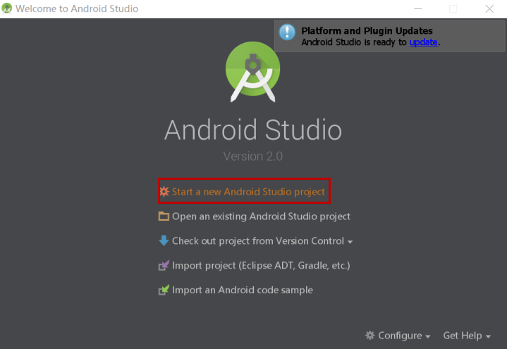
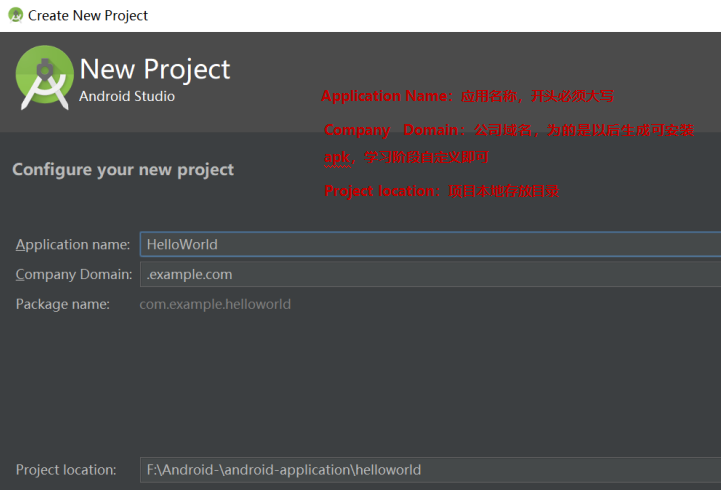
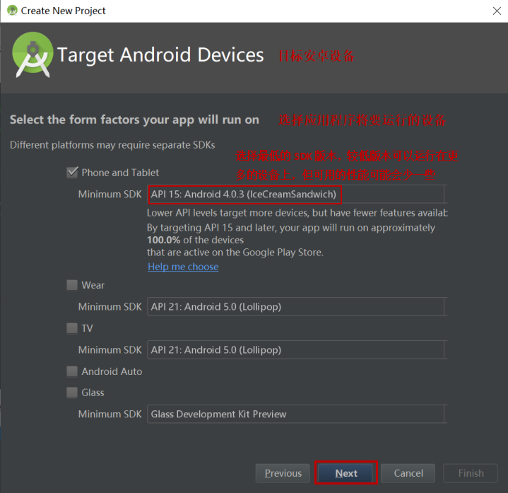
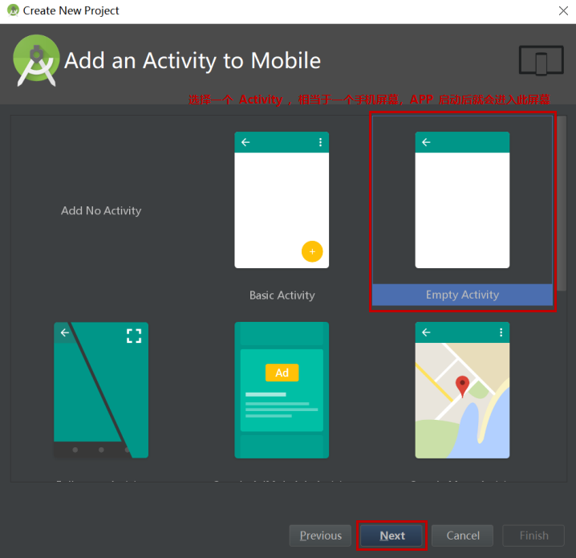
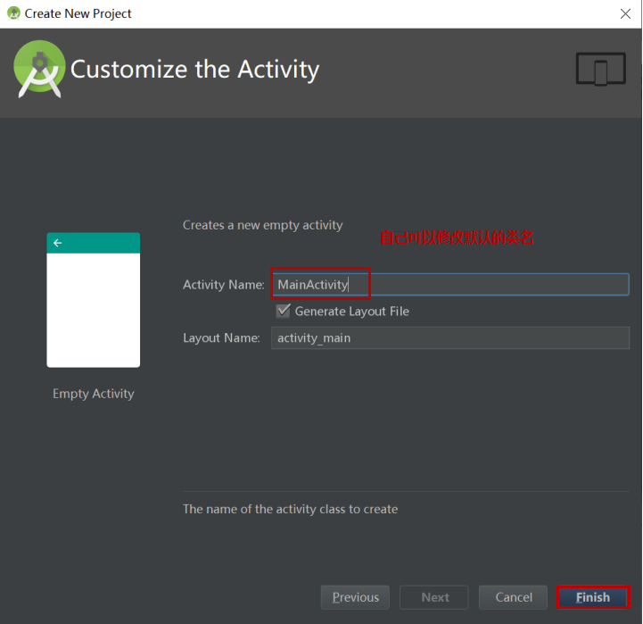
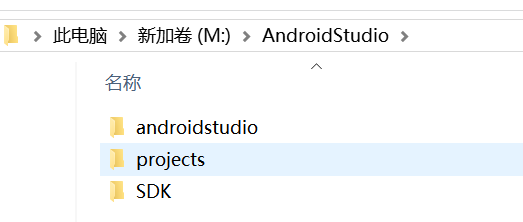

#  **Android****界面布局实验**

## 一、学习官方文档： 

https://developer.android.google.cn/guide/topics/ 

ui/declaring-layout.html 

//学习文档中关于ConstraintLayout, LinearLayout和TableLayout的相关内容

## 二、利用线性布局实现如下界面：

<https://developer.android.google.cn/guide/topics/ui/layout/linear?>



#### 实验步骤：

- 文件结构

 

- strings.xml

  ``

  ```java
  <resources>
      <string name="One">One,One</string>
      <string name="Two">One,Two</string>
      <string name="Three">One,Three</string>
      <string name="Four">One,Four</string>
      <string name="Five">Two,One</string>
      <string name="Six">Two,Two</string>
      <string name="Seven">Two,Three</string>
      <string name="Eight">Two,Four</string>
      <string name="Nine">Three,One</string>
      <string name="Ten">Three,Two</string>
      <string name="Eleven">Three,Three</string>
      <string name="Twelve">Three,Four</string>
      <string name="Thirteen">Four,One</string>
      <string name="Fourteen">Four,Two</string>
      <string name="Fifteen">Four,Three</string>
      <string name="Sixteen">Four,Four</string>
      <string name="app_name">this is a constrain layout</string>
  </resources>
  ```

- activity_main.xml

  ``

  ```java
  <LinearLayout xmlns:android="http://schemas.android.com/apk/res/android"
      xmlns:tools="http://schemas.android.com/tools"
      android:layout_width="match_parent"
      android:layout_height="match_parent"
      android:orientation="vertical" >
  
      <LinearLayout
          android:layout_width="match_parent"
          android:layout_height="wrap_content"
          android:orientation="horizontal" >
  
          <TextView
              android:id="@+id/firstText"
              android:layout_width="109dp"
              android:layout_height="wrap_content"
              android:background="#552BA3"
              android:gravity="center"
              android:textColor="#ECE4EE"
              android:text="@string/One" />
  
          <TextView
              android:id="@+id/secondText"
              android:layout_width="106dp"
              android:layout_height="wrap_content"
              android:background="#552BA3"
              android:gravity="center"
              android:textColor="#ECE4EE"
              android:text="@string/Two" />
  
          <TextView
              android:id="@+id/thirdText"
              android:layout_width="103dp"
              android:layout_height="wrap_content"
              android:background="#552BA3"
              android:gravity="center"
              android:textColor="#ECE4EE"
              android:text="@string/Three" />
  
          <TextView
              android:id="@+id/fourthText"
              android:layout_width="91dp"
              android:layout_height="wrap_content"
              android:background="#552BA3"
              android:gravity="center"
              android:textColor="#ECE4EE"
              android:text="@string/Four" />
  
      </LinearLayout>
  
      <LinearLayout
          android:layout_width="match_parent"
          android:layout_height="wrap_content"
          android:orientation="horizontal" >
  
          <TextView
              android:id="@+id/fifthText"
              android:layout_width="79dp"
              android:layout_height="wrap_content"
              android:background="#552BA3"
              android:gravity="center"
              android:textColor="#ECE4EE"
              android:text="@string/Five" />
  
          <TextView
              android:id="@+id/sixthText"
              android:layout_width="107dp"
              android:layout_height="wrap_content"
              android:background="#552BA3"
              android:gravity="center"
              android:textColor="#ECE4EE"
              android:text="@string/Six" />
  
          <TextView
              android:id="@+id/seventhText"
              android:layout_width="105dp"
              android:layout_height="wrap_content"
              android:background="#552BA3"
              android:gravity="center"
              android:textColor="#ECE4EE"
              android:text="@string/Seven" />
  
          <TextView
              android:id="@+id/eighthText"
              android:layout_width="116dp"
              android:layout_height="wrap_content"
              android:background="#552BA3"
              android:gravity="center"
              android:textColor="#ECE4EE"
              android:text="@string/Eight" />
      </LinearLayout>
  
      <LinearLayout
          android:layout_width="match_parent"
          android:layout_height="wrap_content"
          android:orientation="horizontal" >
  
          <TextView
              android:id="@+id/ninthText"
              android:layout_width="117dp"
              android:layout_height="wrap_content"
              android:background="#552BA3"
              android:gravity="center"
              android:textColor="#ECE4EE"
              android:text="@string/Nine" />
  
          <TextView
              android:id="@+id/tenthText"
              android:layout_width="97dp"
              android:layout_height="wrap_content"
              android:background="#552BA3"
              android:gravity="center"
              android:textColor="#ECE4EE"
              android:text="@string/Ten" />
  
          <TextView
              android:id="@+id/eleventhText"
              android:layout_width="109dp"
              android:layout_height="wrap_content"
              android:background="#552BA3"
              android:gravity="center"
              android:textColor="#ECE4EE"
              android:text="@string/Eleven" />
  
          <TextView
              android:id="@+id/twelfthText"
              android:layout_width="86dp"
              android:layout_height="wrap_content"
              android:background="#552BA3"
              android:gravity="center"
              android:textColor="#ECE4EE"
              android:text="@string/Twelve" />
      </LinearLayout>
  
      <LinearLayout
          android:layout_width="match_parent"
          android:layout_height="wrap_content"
          android:orientation="horizontal" >
  
          <TextView
              android:id="@+id/thirteenthText"
              android:layout_width="74dp"
              android:layout_height="wrap_content"
              android:background="#552BA3"
              android:gravity="center"
              android:textColor="#ECE4EE"
              android:text="@string/Thirteen" />
  
          <TextView
              android:id="@+id/fourteenthText"
              android:layout_width="109dp"
              android:layout_height="wrap_content"
              android:background="#552BA3"
              android:gravity="center"
              android:textColor="#ECE4EE"
              android:text="@string/Fourteen" />
  
          <TextView
              android:id="@+id/fifteenthText"
              android:layout_width="121dp"
              android:layout_height="wrap_content"
              android:background="#552BA3"
              android:gravity="center"
              android:textColor="#ECE4EE"
              android:text="@string/Fifteen" />
  
          <TextView
              android:id="@+id/sixteenthText"
              android:layout_width="103dp"
              android:layout_height="wrap_content"
              android:background="#552BA3"
              android:gravity="center"
              android:text="@string/Sixteen"
              android:textColor="#ECE4EE" />
      </LinearLayout>
  
  </LinearLayout>
  ```

- Preview

 

 

## 三、利用ConstraintLayout实现如下界面：

<https://developer.android.google.cn/training/constraint-layout?>



#### 实验步骤： 

- Strings.xml

  ``

  ```java
  <resources>
      <string name="One"> RED</string>
      <string name="Two">GREEN</string>
      <string name="Three">BLUE</string>
      <string name="Four">PURPLE</string>
      <string name="Five">YELLOW</string>
      <string name="Six">ORANGE</string>
      <string name="app_name">this is a constrain layout</string>
  </resources>
  ```

- Activity_main.xml

  ``

  ```java
  <androidx.constraintlayout.widget.ConstraintLayout xmlns:android="http://schemas.android.com/apk/res/android"
      xmlns:app="http://schemas.android.com/apk/res-auto"
      xmlns:tools="http://schemas.android.com/tools"
      android:id="@+id/constraintLayout"
      android:layout_width="match_parent"
      android:layout_height="match_parent"
      tools:layout_editor_absoluteY="25dp">
  
      <TextView
          android:id="@+id/firstText"
          android:layout_width="91sp"
          android:layout_height="62sp"
          android:layout_marginTop="116sp"
          android:background="#FF0000"
          android:padding="20dp"
          android:text="@string/One"
          android:gravity="center"
          app:layout_constraintTop_toTopOf="parent"
          tools:layout_editor_absoluteX="288sp" />
  
      <TextView
          android:id="@+id/secondText"
          android:layout_width="93sp"
          android:layout_height="67sp"
          android:background="#8BC34A"
          android:padding="20sp"
          android:text="@string/Two"
          android:gravity="center"
          app:layout_constraintBottom_toBottomOf="parent"
          app:layout_constraintEnd_toEndOf="parent"
          app:layout_constraintHorizontal_bias="0.0"
          app:layout_constraintLeft_toLeftOf="parent"
          app:layout_constraintRight_toLeftOf="parent"
          app:layout_constraintStart_toStartOf="parent"
          app:layout_constraintTop_toTopOf="parent"
          app:layout_constraintVertical_bias="0.0" />
  
      <TextView
          android:id="@+id/thirdText"
          android:layout_width="127sp"
          android:layout_height="72sp"
          android:background="#2196F3"
          android:padding="20sp"
          android:text="@string/Three"
          android:gravity="center"
          app:layout_constraintBottom_toBottomOf="parent"
          app:layout_constraintTop_toTopOf="parent"
          app:layout_constraintVertical_bias="0.0"
          tools:layout_editor_absoluteX="140sp" />
  
      <TextView
          android:id="@+id/fourthText"
          android:layout_width="103sp"
          android:layout_height="68sp"
          android:background="#673AB7"
          android:padding="20sp"
          android:text="@string/Four"
          android:gravity="center"
          app:layout_constraintBottom_toBottomOf="parent"
          app:layout_constraintEnd_toEndOf="parent"
          app:layout_constraintHorizontal_bias="1.0"
          app:layout_constraintLeft_toLeftOf="parent"
          app:layout_constraintRight_toLeftOf="parent"
          app:layout_constraintStart_toStartOf="parent"
          app:layout_constraintTop_toTopOf="parent"
          app:layout_constraintVertical_bias="0.0" />
  
      <TextView
          android:id="@+id/fifthText"
          android:layout_width="95sp"
          android:layout_height="64sp"
          android:layout_marginBottom="424dp"
          android:background="#FFEB3B"
          android:gravity="center"
          android:padding="20sp"
          android:text="@string/Five"
          app:layout_constraintBottom_toBottomOf="parent"
          tools:layout_editor_absoluteX="45dp" />
  
      <TextView
          android:id="@+id/sixthText"
          android:layout_width="100sp"
          android:layout_height="64sp"
          android:background="#F44336"
          android:padding="20dp"
          android:text="@string/Six"
          android:gravity="center"
          app:layout_constraintEnd_toEndOf="parent"
          app:layout_constraintHorizontal_bias="0.53"
          app:layout_constraintLeft_toLeftOf="parent"
          app:layout_constraintRight_toLeftOf="parent"
          app:layout_constraintStart_toStartOf="parent"
          tools:layout_editor_absoluteY="115sp" />
  
  </androidx.constraintlayout.widget.ConstraintLayout>
  ```

- Preview

 

 

## 四、利用表格布局实现如下界面：


#### 实验步骤： 

- Strings.xml

  ``

  ```java
  <resources>
      <string name="One">Open...</string>
      <string name="Two">Ctrl-O</string>
      <string name="Three">Save...</string>
      <string name="Four">Ctrl-S</string>
      <string name="Five">Save As...</string>
      <string name="Six">Ctrl-Shift-S</string>
      <string name="Seven">X Import...</string>
      <string name="Eight">X Export...</string>
      <string name="Nine">  Ctrl-E</string>
      <string name="Ten">  Quit</string>
      <string name="Twelve">    </string>
      <string name="app_name">this is a table layout</string>
  </resources>
  ```

- Activity_main.xml

  ``

  ```java
  <TableLayout xmlns:android="http://schemas.android.com/apk/res/android"
      xmlns:tools="http://schemas.android.com/tools"
      android:layout_width="match_parent"
      android:layout_height="wrap_content"
      android:stretchColumns="*">
  
      <TableRow
          android:layout_width="match_parent"
          android:layout_height="match_parent">
  
          <TextView
              android:id="@+id/firstText"
              android:layout_width="352dp"
              android:layout_height="wrap_content"
              android:layout_weight="1"
              android:background="#C89C27B0"
              android:text="@string/One" />
  
          <TextView
              android:id="@+id/secondText"
              android:layout_width="53dp"
              android:layout_height="wrap_content"
              android:layout_weight="1"
              android:background="#C89C27B0"
              android:text="@string/Two"
              android:textAppearance="@style/TextAppearance.AppCompat.Body1"
              android:visibility="visible"
              tools:visibility="visible" />
      </TableRow>
  
      <TableRow
          android:layout_width="fill_parent"
          android:layout_height="wrap_content">
  
          <TextView
              android:id="@+id/thirdText"
              android:layout_width="wrap_content"
              android:layout_height="match_parent"
              android:layout_weight="1"
              android:background="#C89C27B0"
              android:text="@string/Three" />
  
          <TextView
              android:id="@+id/fourthText"
              android:layout_width="wrap_content"
              android:layout_height="wrap_content"
              android:layout_weight="1"
              android:background="#C89C27B0"
              android:text="@string/Four" />
      </TableRow>
  
      <TableRow
          android:layout_width="fill_parent"
          android:layout_height="wrap_content">
  
          <TextView
              android:id="@+id/fifthText"
              android:layout_width="307dp"
              android:layout_height="match_parent"
              android:layout_weight="1"
              android:background="#C89C27B0"
              android:text="@string/Five" />
  
          <TextView
              android:id="@+id/sixthText"
              android:layout_width="wrap_content"
              android:layout_height="match_parent"
              android:background="#C89C27B0"
              android:text="@string/Six" />
      </TableRow>
  
      <TableRow
          android:layout_width="fill_parent"
          android:layout_height="wrap_content">
          <TextView
              android:id="@+id/otherText"
              android:layout_width="371dp"
              android:layout_height="3sp"
              android:layout_weight="1"
              android:background="#F6F7F4"
              android:text="@string/Twelve" />
      </TableRow>
  
      <TableRow
          android:layout_width="fill_parent"
          android:layout_height="wrap_content">
  
          <TextView
              android:id="@+id/seventhText"
              android:layout_width="283dp"
              android:layout_height="match_parent"
              android:layout_weight="1"
              android:background="#C89C27B0"
              android:text="@string/Seven" />
  
      </TableRow>
  
      <TableRow
          android:layout_width="fill_parent"
          android:layout_height="wrap_content">
  
          <TextView
              android:id="@+id/eighthText"
              android:layout_width="346dp"
              android:layout_height="match_parent"
              android:layout_weight="1"
              android:background="#C89C27B0"
              android:text="@string/Eight" />
  
          <TextView
              android:id="@+id/ninthText"
              android:layout_width="wrap_content"
              android:layout_height="match_parent"
              android:layout_weight="1"
              android:background="#C89C27B0"
              android:text="@string/Nine" />
      </TableRow>
      <TableRow
          android:layout_width="fill_parent"
          android:layout_height="wrap_content">
          <TextView
              android:id="@+id/oText"
              android:layout_width="371dp"
              android:layout_height="3sp"
              android:layout_weight="1"
              android:background="#F6F7F4"
              android:text="@string/Twelve" />
      </TableRow>
  
      <TableRow
          android:layout_width="fill_parent"
          android:layout_height="wrap_content">
  
          <TextView
              android:id="@+id/tenthText"
              android:layout_width="wrap_content"
              android:layout_height="match_parent"
              android:layout_weight="1"
              android:background="#C89C27B0"
              android:text="@string/Ten" />
  
      </TableRow>
  
  </TableLayout>
  ```

- Preview

 

 